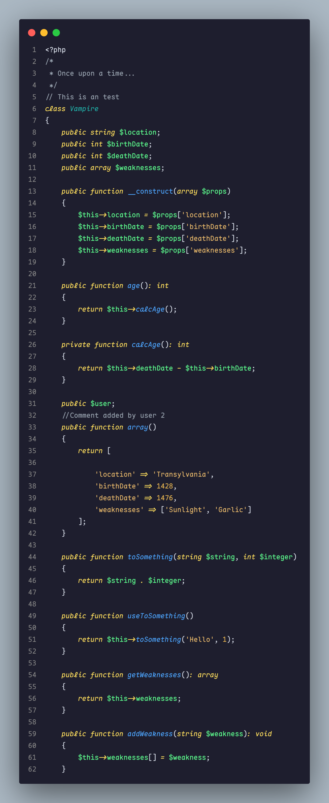
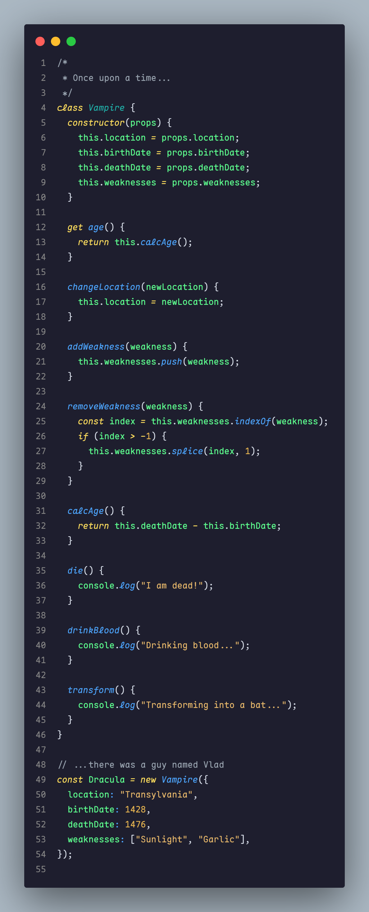
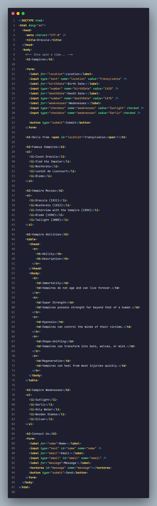

# Emerald Eclipse

 

# Screenshots

<p>



</p>

# Installation

1. Open Visual Studio Code
2. Go to Extensions (Ctrl+Shift+X / Cmd+Shift+X)
3. Search for "Emerald Eclipse"
4. Click Install to install it
5. Code/File > Preferences > Color Theme > Emerald Eclipse

## Supported Languages

- JavaScript
- Vuejs
- HTML/CSS
- PHP
- Blade
- Markdown
- Typescript (WIP)

# How to Contribute

> Open for contributions.

1. Fork & Clone the [repo](https://github.com/KjartanBourgeois/emerald-eclipse)

   ```pwsh
   git clone git@github.com:{YOUR_GITHUB_USERNAME}/emerald-eclipse.git
   ```

2. Move to the `emerald-eclipse` directory

   ```pwsh
   cd emerald-eclipse
   ```

3. Make the required changes in color-schema & other properties in: `./themes/Emerald-Eclipse-color-theme.json`. Also update the **_version_** in `./package.json`.

4. For packaging we're using `vsce` package and `Yeoman` & `generator-code` for management. So install the required dependencies.

   ```pwsh
   npm install -g vsce yo generator-code
   ```

5. Then package the changes, to be pushed into Marketplace

   ```pwsh
   vsce package
   ```

   > This should generate a `emerald-eclipse-{VERSION}.vslx` file. If not then resolve the errors being caused.

6. Commit & push the updated changes. Then make a PR to this [repo](https://github.com/KjartanBourgeois/emerald-eclipse).
   <br/><br/>
